It's just after midnight on November 28, 2025, as I write this. Today is officially my last working day at [ThoughtSpot](https://www.thoughtspot.com/). In my eight years as a software engineer, I've progressed from an intern to a senior role, completing what I estimate to be about 23% of my professional career. While that may not sound like much compared to the long road ahead, I have worked as an intern at an early-stage startup, a junior engineer at a bank and a MAANG company, a mid-level engineer at another MAANG, and a senior engineer at a mid-stage company. In all this time, I have reported to 14 different managers—a new one every seven months on average. This high number, despite this being only my fourth company, is a result of organizational restructuring, managers leaving, team switches, and promotions.

Coincidentally, my current manager has also been my longest-serving one. For my entire tenure at [ThoughtSpot](https://www.thoughtspot.com/), I reported to the same person. Now, after eight years in the industry and as I prepare for a new opportunity, I truly appreciate the value of a great manager. I understand the difference between a bad, average, good, and great one. While I won't focus on the former, this article will explore what makes a manager great and the profound impact they can have on your professional life.

## Why do you even need a manager

To understand the role of a great manager, we first need to understand why you need a manager at all. For the first few years of my career, I believed I could work so effectively that I wouldn't need a manager. If I had stuck with that mindset, you wouldn't be reading this post.

When a company is founded, it typically consists of a small group of people—one handling sales, another operations, a third finance, and perhaps someone who is a jack-of-all-trades. Life is simple, and communication is clear. These individuals can sit down over a meal and decide what to do next; there is no need for a manager.

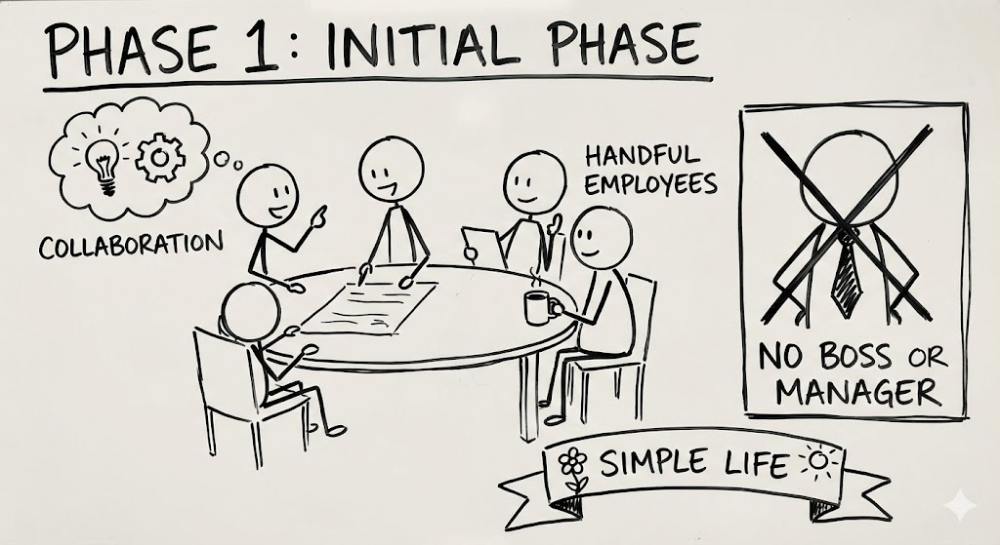

Things start to speed up, and there are more problems to solve than you can humanly handle. You hire more people—experts who can solve these problems for you. But then you don't know who will do what, and what tasks individuals are working on. Things start to get messy.

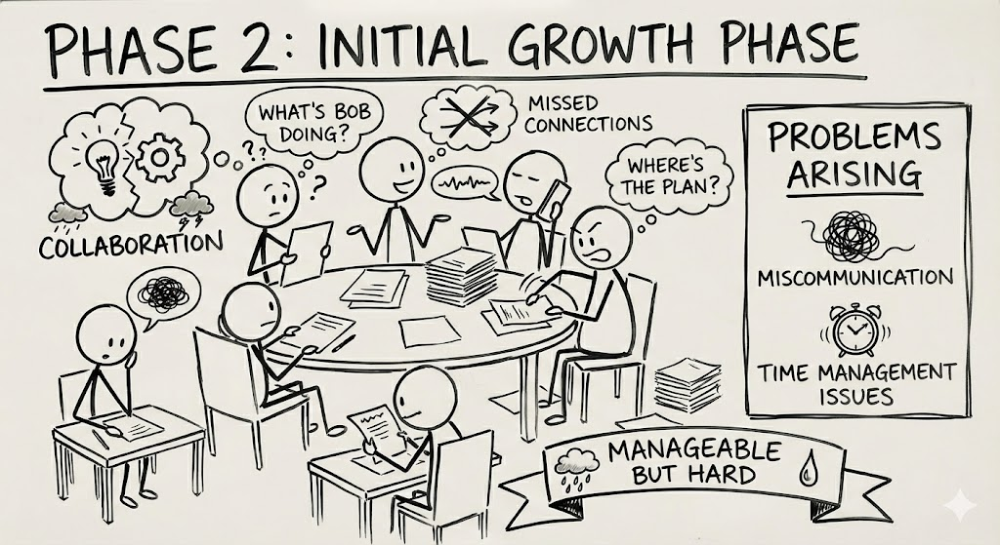

Now you are growing even faster. You've doubled your employee count, and there are a lot of people doing a lot of things. Everyone is doing something, but no one knows what, and very few know why. It's chaos.

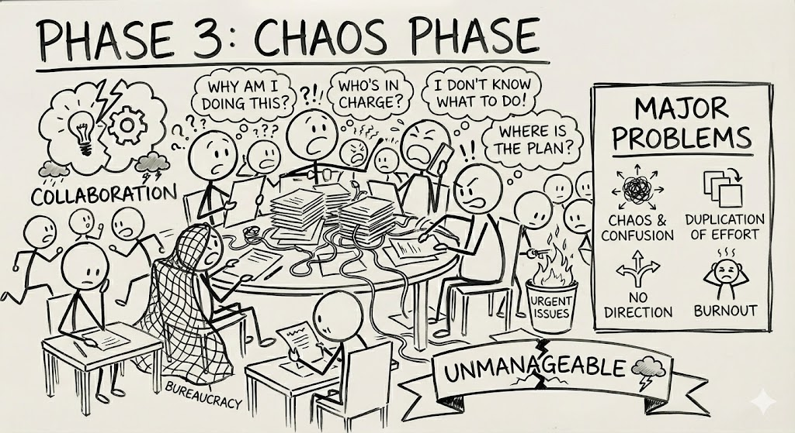

Things are out of control. You need someone who can manage people, expectations, communication, collaboration, direction, and everything else that is spiraling out of hand. That's where managers come in.

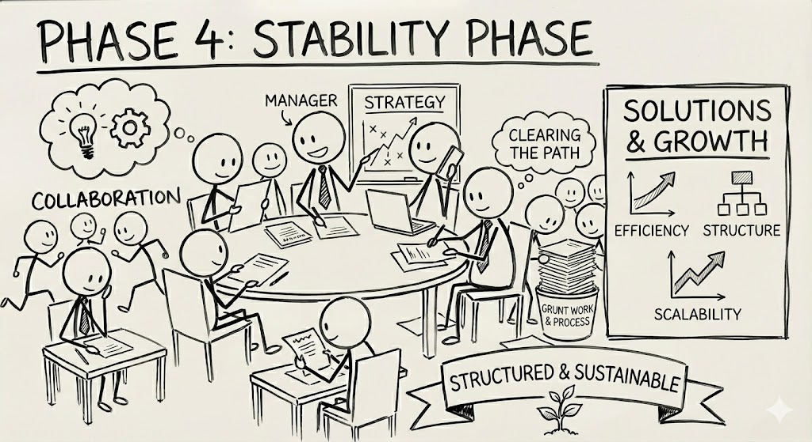

This is why the title `Manager` exists—to manage things that individuals cannot. In large companies and teams, the role of a great manager becomes indispensable. In my short career, I have seen how good managers can accomplish goals, how bad managers can make things worse, and how great managers can achieve amazing results.

## Managers in tech companies

When it comes to tech companies, life without a manager might look chaotic and haywire:

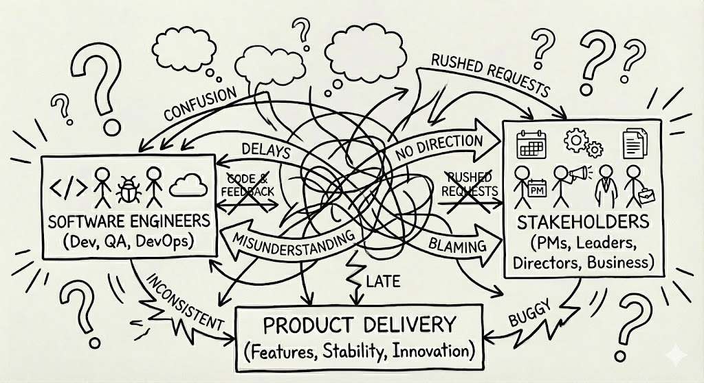

Whereas a manager might simplify a lot of things for you to focus on things which you are good at:

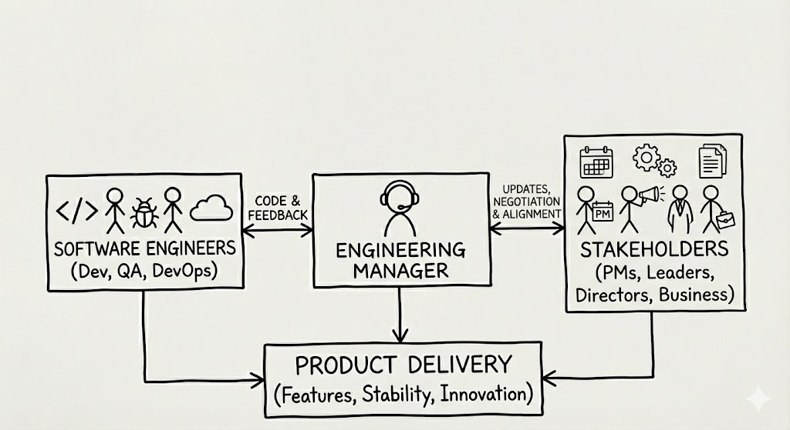

## Attributes of The Great Manager

> _But why are we even talking about **`The Great Manager`**? I want to know who is **`The Best Manager`**, how do I know that?_

Who is the best footballer—**Cristiano Ronaldo** or **Lionel Messi**? Don't fight. Now, tell me who is the best scientist the world has ever seen—**Albert Einstein**, **Isaac Newton**, or **Stephen Hawking**? Exactly. You cannot have 'the best manager.' You can only have **the best manager for you**—someone who understands your working style—or the best manager of your career, but there can never be a universally best manager for everyone. Managers are human, trying to find calm in the chaos. Different managers have different styles, and some may work well with a certain group of people, while others may not. What works for one set of problems, domains, or people might not be as effective for another. So, we will only talk about **great managers**.

### Scopes work for you and your peers

A great manager constantly gauges your strengths and knows what you can and cannot do. When they have a bag full of work to assign, they will give you the tasks you are best at. At the same time, they will sometimes mix in work you don't enjoy. This is because work needs to be done, whether we like it or not. If you only get tasks you like, you might take them for granted and not work on tasks that don't interest you. If everyone on a team only works on what they enjoy, some work will never get picked up.

A great manager will also regularly assign you work you are not good at. For instance, if someone is bad at public speaking, they may be asked to give a short demonstration to the immediate leadership. If someone is not good at on-calls, they will be asked to handle more issues than others on the team. This is to ensure you can grow.

A great manager ensures that the ratio of the work you like, the work you are good at, the work you don't like, and the work you are not good at is balanced in a way that you feel consistent and get better. A great manager will make sure you become a better overall contributor.

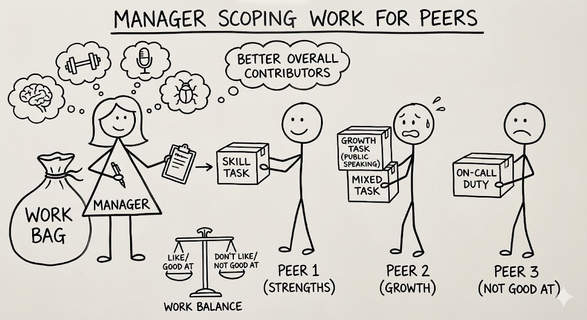

### Treats you like a human

Human productivity might look consistent or smooth if you look at longer time frames like quarters or months. For instance, you might say you worked more and better this year than last year. But when it comes to daily productivity, it can vary significantly. You might get sick, have a personal event, prepare for a social or family gathering, plan a vacation, feel a lack of motivation, or have to repair your car. A great manager understands that you are human and that this is normal. They will ensure you are improving over the long term while making sure that small productivity blips don't derail you or your progress. They will also promote consistency and discourage fads like 70-hour workweeks or late-night work. If you have to commit to such long hours temporarily, they will make sure to compensate by giving you time to recharge.

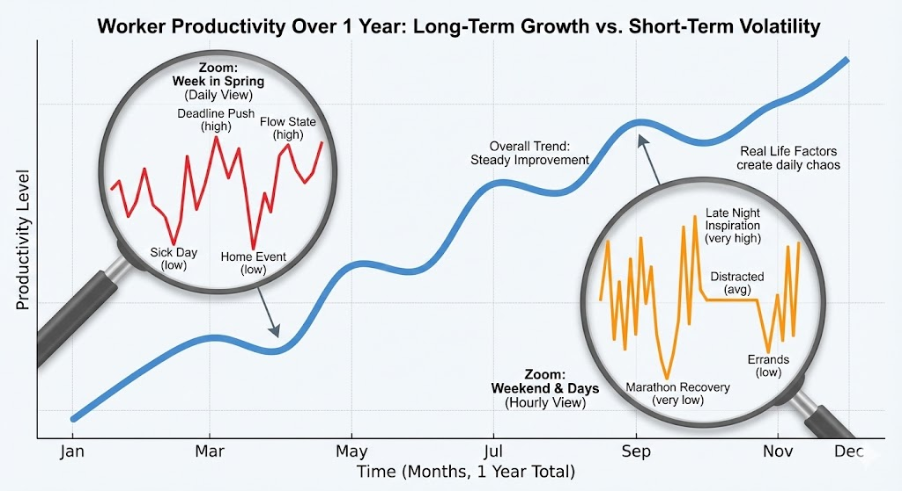

### Knows when and how to act like a partner

There will be times when there is more work for the team than there is bandwidth, and everyone is stretched and tired. A great manager will not hesitate to get their hands dirty and act as a partner. They will take on trivial tasks to reduce context switching and ensure the team can work with maximum momentum. They might handle trivial bugs and take up work cycles on less important tasks.

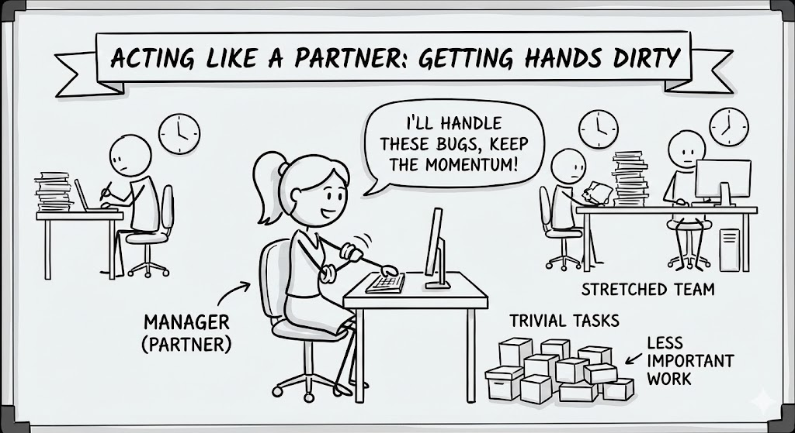

### Provides the right feedback at the right time

Every team member will have different strengths: one might be a great planner, another a great communicator, and a third great at execution. One might be less vocal, while another is an extrovert. One might be a quick learner, while another is slower. A great manager recognizes each report's weaknesses and gives them feedback in a way they can digest and work on. They will ensure growth for both the team and the individual.

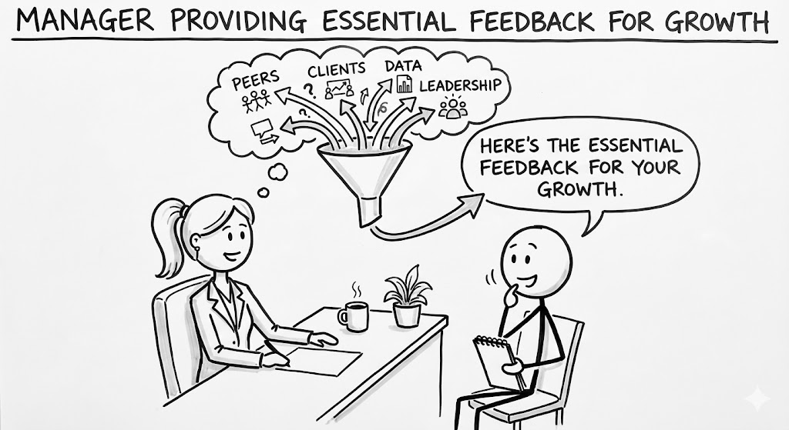

### Trusts, and verifies if required

Trust builds over time. When you report to a great manager, they don't start trusting you on day one. They will analyze what you are good at and what you are not, and slowly begin to trust you and your work. As your work and scope grow, trust deepens, and when that happens, the manager starts to take a step back. This shows they trust you, and now the manager can focus on other problems.

### Acts like a leader when required

There will be times when there is ambiguity in the air, when the solution isn't clear and the direction looks murky. In those cases, a great manager steps up and makes a call. They might descope parts of the problem or ask to go a certain way with calculated risk, but if required, they can act like a leader.

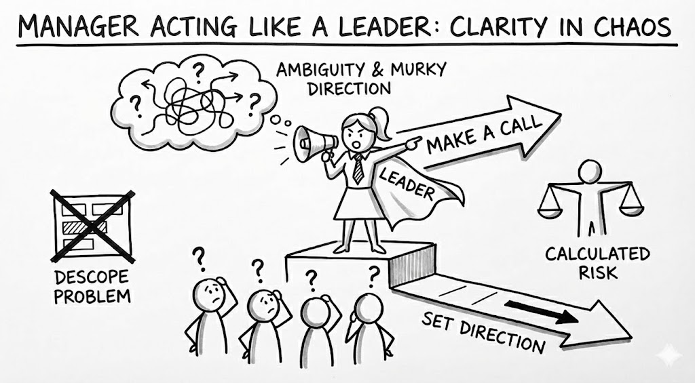

### Provides stability

Every manager has a different style, and when the manager or the organization changes, a lot can change. Projects might get reshuffled, people might be moved, and business priorities might shift. In all of this, if you are lucky enough to have the same great manager, they will try to ensure the impact of this change on your work is minimal.

### Is your cheer-leader

A great manager will also be your personal cheerleader. They will ensure that your good qualities are clearly reflected where they need to be, such as in promotion discussions or in front of leadership and stakeholders. They will make sure that any negative impressions of you are understood and acknowledged, and that feedback is given to ensure corrections can be made. A great manager will mostly act as a cheerleader for you in public and work on your shortcomings in private.

### Is human

And in the end, managers are human, and like every other human, they will make mistakes. They might misjudge, over-trust someone, or underestimate tasks. They might hire the wrong candidate or fail to get stakeholders on the same page. They can make any kind of mistake that another employee can make. But a great manager will ensure they learn from their mistakes. A great manager will not shy away from conversations and will ask for feedback if required. They will ensure that they become better as well.

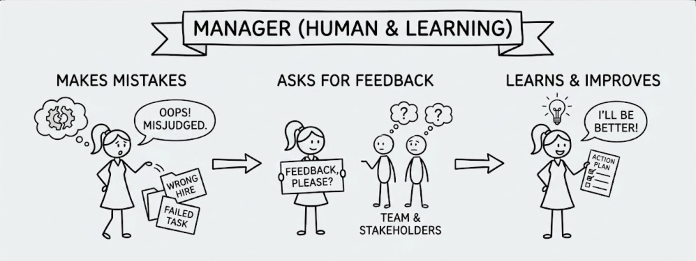

## Acknowledgements

This article was inspired by [Ruchi Bajpai](https://www.linkedin.com/in/ruchi-bajpai-bb3552/), my manager at [ThoughtSpot](https://www.thoughtspot.com). After working with her, I truly realized how a great manager can help you make huge improvements in your work. I have been lucky to find many great managers who have shaped how I work, and I am very grateful to all of them.

:::note
The views expressed in this article are my own and does not represent those of my current, past or future employers. The content has been written by a human, and images have been generated via AI - [Google Nano Banana Pro](https://gemini.google/overview/image-generation/).

